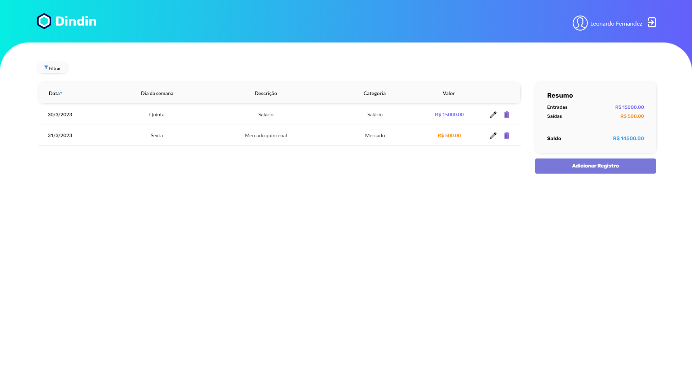

<h1 align="center"> Dindin </h1>

Aplicativo de registro e controle de finanças pessoais.

  <a href="#-tecnologias">Tecnologias</a>&nbsp;&nbsp;&nbsp;|&nbsp;&nbsp;&nbsp;
  <a href="#-projeto">Projeto</a>&nbsp;&nbsp;&nbsp;|&nbsp;&nbsp;&nbsp;
  <a href="#-layout">Layout</a>&nbsp;&nbsp;&nbsp;

 

  

## 🚀 Tecnologias

Esse projeto foi desenvolvido com as seguintes tecnologias:

- NodeJS
- JavaScript
- Postgres(SQL)
- Encriptação de dados
- Token de autenticação
- Git e Github

## 💻 Projeto

O sistema trata-se de uma aplicação para controle de finanças pessoais. Nesta aplicação consta as seguintes funcionalidades são:

- Cadastrar Usuário
- Fazer Login 
- Detalhar Perfil do Usuário Logado 
- Editar Perfil do Usuário Logado 
- Listar categorias 
- Listar transações 
- Detalhar transação 
- Cadastrar transação 
- Editar transação 
- Remover transação 
- Obter extrato de transações 
- Filtrar transações por categoria 

## 🔖 Layout

Você pode visualizar o layout do projeto através [DESSE LINK](https://www.figma.com/file/BwOAJkF8OeMON36TyFdhkj/DinDin-2.0?node-id=0%3A1). É necessário ter conta no [Figma](https://figma.com) para acessá-lo.